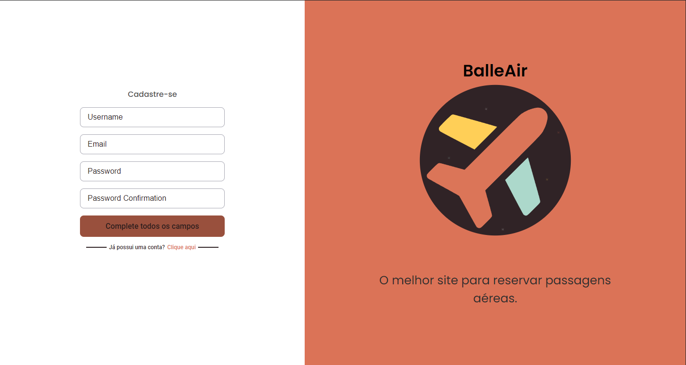
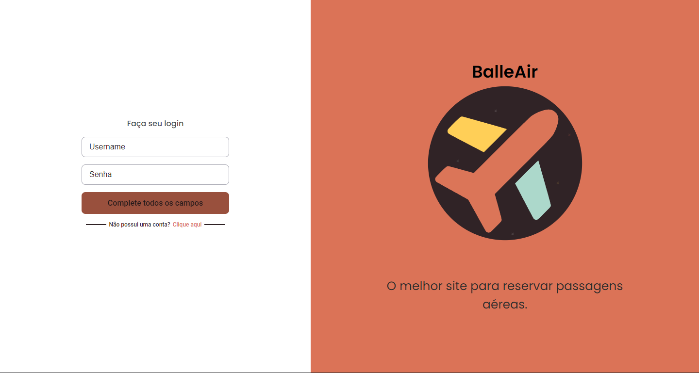
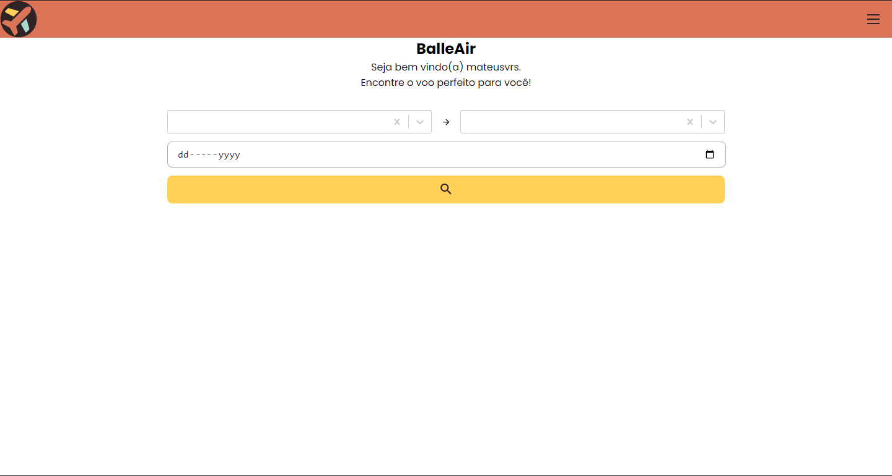
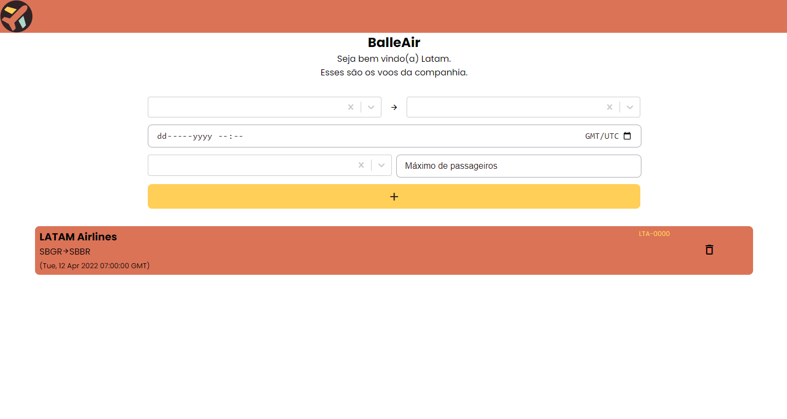

<header>
    <h1 align="center">BalleAir Frontend</h1>
</header>
 
<main>
    

        <h2>📑 Pages</h2>
        

            <h2>Public Pages</h2>
            <h3>Register Page</h3>
            
On this page people can create a user record.

            
            <h3>Login Page</h3>
            
On this page users can login to the site.

            
            <h2>Private Pages</h2>
            <h3>Home Page</h3>
            
On this page travelers can search for flights.

            
            <h3>Flights Page</h3>
            
On this page, travelers can check their reservations and airlines can check their flights.

            
        

    

     
    

        <h2>💻 Technologies</h2>
        <ul>
            <li><a target="_blank" rel="noreferrer" href="https://reactjs.org/">React.js</a></li>
            <li>Packages:</li>
            <ul>
                <li><a target="_blank" rel="noreferrer" href="https://react-select.com/home">React Select</a></li>
                <li><a target="_blank" rel="noreferrer" href="https://react-hot-toast.com/">React Hot Toast</a></li>
                <li><a target="_blank" rel="noreferrer" href="https://github.com/reactjs/react-modal">React Modal</a></li>
            </ul>
            <li><a target="_blank" rel="noreferrer" href="https://www.typescriptlang.org/">Typescript</a></li>
            <li><a target="_blank" rel="noreferrer" href="https://sass-lang.com/">Sass</a></li>
        </ul>
    

     
    

        <h2>✏️ Project (Extra)</h2>
        
BalleAir was a challenge proposed by the Ballerini Community. The project consisted of creating an API in which it was possible to list, book and cancel airline flights. However, I created this frontend also to improve the proposed challenge.

    

     
    

        <h2>📱 Compatibility</h2>
        <ul>
            <li>Browser (Web)</li>
            <ul>
                <li>Desktop</li>
                <li>Mobile</li>
            </ul>
        </ul>
    

     
    

        <h2>🎨 Design</h2>
        
Designed by <a target="_blank" rel="noreferrer" href="https://www.linkedin.com/in/mateusvrs/">Mateus
            Vieira</a>

    

     
    

        

        
Proposed by the <a target="_blank" rel="noreferrer" href="http://discord.gg/ballerini">Ballerini
                Community</a>

        
Developed by <a target="_blank" rel="noreferrer" href="https://www.linkedin.com/in/mateusvrs/">Mateus
                Vieira</a> 💛

    

</main>
